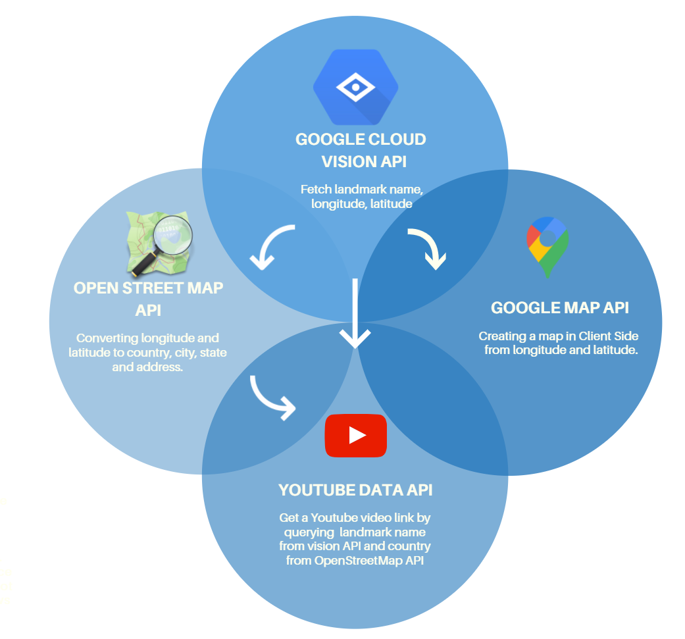

# PlaceScanner

The main purpose of this API mashup is searching and providing knowledge from the pictures of popular landmarks across the nations. The idea of this mashup is to give information quickly from an image which was uploaded by the user. In return, the user will get information on the places from an image which have been uploaded to the web app. The information will be in the form of a Youtube video, the country, city, state and address of which the landmark is located, with a map to show the exact location of the landmark.

## List of APIs used:

  

## Local Setup
- Put your Youtube and Google map API keys in .env file.
- Download your Google Vision Private Key File and save your credentials in auth/googlevision_key.json. For more information on how to get your private key file visit this [link](https://cloud.google.com/vision/docs/setup).
- In the main directory, run:
   - npm install
   - npm start

# Further Information
View the [video](https://youtu.be/auXmh3gOpuw) of the web app to understand its features.